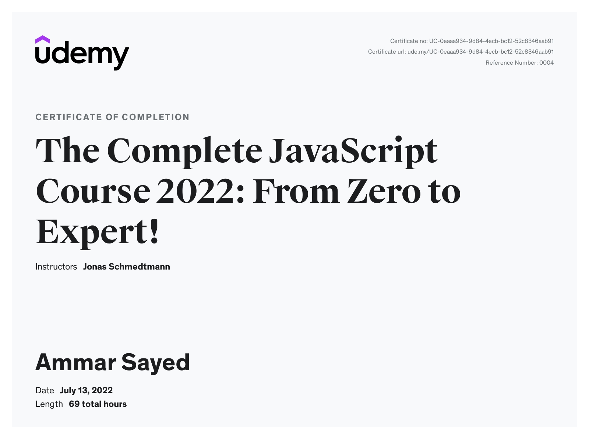

# The Complete JavaScript Course 2022: From Zero to Expert!

## How to use

The code snapshots are organized in multiple **branches** where every branch **represents a course section**.

You can switch branches via the branch dropdown above the directory explorer.

### [Udemy course](https://www.udemy.com/course/the-complete-javascript-course/)

### [Course Certificate](https://www.udemy.com/certificate/UC-0eaaa934-9d84-4ecb-bc12-52c8346aab91/)

## What you will learn

- Become an advanced, confident, and modern JavaScript developer from scratch
- Build 6 beautiful real-world projects for your portfolio (not boring toy apps)
- Become job-ready by understanding how JavaScript really works behind the scenes
- How to think and work like a developer: problem-solving, researching, workflows
- JavaScript fundamentals: variables, if/else, operators, boolean logic, functions, arrays, objects, loops, strings, etc.
- Modern ES6+ from the beginning: arrow functions, destructuring, spread operator, optional chaining (ES2020), etc.
- Modern OOP: Classes, constructors, prototypal inheritance, encapsulation, etc.
- Complex concepts like the 'this' keyword, higher-order functions, closures, etc.
- Asynchronous JavaScript: Event loop, promises, async/await, AJAX calls and APIs
- How to architect your code using flowcharts and common patterns
- Modern tools for 2022 and beyond: NPM, Parcel, Babel and ES6 modules
- Practice your skills with 50+ challenges and assignments (solutions included)
- Get fast and friendly support in the Q&A area
- Course pathways: design your unique learning path according to your goals!

---

## Live hosted Projects

- [Pig Game](https://) (DOM Manipulation)
- [Bankist](https://) (Arrays, Numbers, Dates, Timers. Fake "log in" with user `js` and PIN `1111`)
- [Bankist Site](https://) (Advanced DOM and Events)
- [Mapty](https://) (OOP, Geolocation, Project planning)
- [forkify](https://) (Final advanced project)

---
